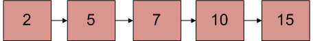
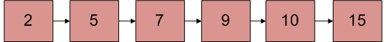

0x01. Insert in sorted linked list
Given a linked list which is sorted, how will you insert in sorted way
Given a sorted linked list and a value to insert, write a function to insert the value in a sorted way.

Initial Linked List of 9

